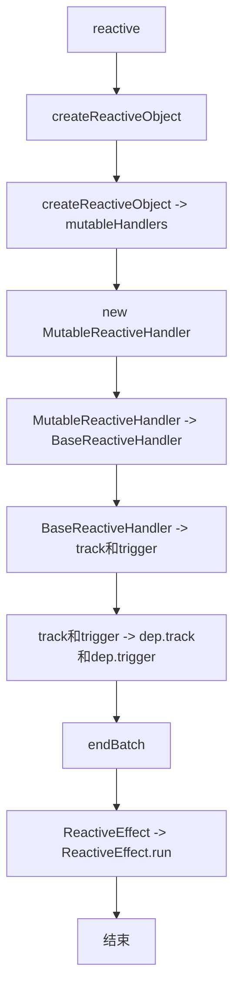

# Vue3

## 响应式实现分析流程

[vue core核心实现代码](https://github.com/vuejs/core)


## reactive函数

> 作为分析vue响应式函数的入口，reactive函数会创建一个响应式的数据。
> 1. 更新响应数据时触发监听的回调函数，如computed和watch的callback函数。
> 2. 更新响应数据时触发UI更新。

在reactive函数实现中，通过调用[createReactiveObject](#createreactiveobject函数)来创建一个响应式数据。

<<< @/frameworks/vue/core/reactivity/src/reactive.ts#reactive{22-33}
<<< @/frameworks/vue/core/reactivity/src/baseHandlers.ts#mutableHandlers{22-28}

## createReactiveObject函数

> 这个函数实现了创建响应式数据的核心逻辑，创建proxy代理对象并重写方法，如get，set等。
> 
> 1. 创建响应式数据时，会创建一个Proxy对象，并返回这个Proxy对象。
> 2. 创建Proxy对象时，会传入一个handler对象，这个handler对象会定义Proxy对象的行为。
> 3. handler对象会定义Proxy对象行为，如get和set方法。当传入的对象是Array,Object类型时，会使用[baseHandlers](#BaseReactiveHandler)。当传入的对象是Map，Set，WeakMap，WeakSet类型时，会使用collectionHandlers。

<<< @/frameworks/vue/core/reactivity/src/reactive.ts#createReactiveObject{36-39}

## BaseReactiveHandler

> 基类，实现了ProxyHandler的get方法，在get方法中会调用[ track ](#track函数)函数，将访问的数据和数据所在的对象添加到依赖关系中，后续数据的赋值会触发set方法内部的[ trigger ](#trigger函数)函数，实现数据更新和UI更新。

```ts
const mutable = reactive({ a: 1 })
mutable.a = 2;
// mutable.a; get -> track 这一步调用了对象的get方法，会触发track函数
// mutable.a = 2; set -> trigger 这一步调了对象的set方法，会触发trigger函数，触发依赖关系中的回调函数。
```

> 在createReactiveObject中的baseHandlers参数实例[mutableHandlers](#mutablereactivehandler)就是继承了BaseReactiveHandler这个基类，然后实现了对应类型的专有方法。

<<< @/frameworks/vue/core/reactivity/src/baseHandlers.ts#BaseReactiveHandler{40,42,45,53,68}

## MutableReactiveHandler

> 针对Object和Array类型的响应式数据，继承BaseReactiveHandler基类，并实现了Object和Array类型专有的方法。
>
> 在数据发生变化时触发[trigger](#trigger函数)方法，触发依赖关系中的回调函数。进行数据更新和UI更新。

<<< @/frameworks/vue/core/reactivity/src/baseHandlers.ts#MutableReactiveHandler{12,14,43,53,56,71,80-81,87-92}

## track函数

> track函数涉及到了Dep的初始化，以及依赖关系添加。

<<< @/frameworks/vue/core/reactivity/src/dep.ts#track{13,18,21,23-25,34-35}

### Vue3什么时候会调用track函数

在vue3中，响应式对象的依赖收集并不是在响应式初始化时添加的，只有在访问了对象的属性时，才会将该属性添加的对象的响应式依赖关系Map中。

调用track的方法有: get, has, ownKeys等。

## trigger函数

> trigger函数会触发依赖关系中的回调函数，进行数据更新和UI更新。

<<< @/frameworks/vue/core/reactivity/src/dep.ts#trigger{17,37,72}

## endBatch 函数

> 当所有批处理结束时运行批处理效果。

<<< @/frameworks/vue/core/reactivity/src/effect.ts#endBatch{32-33}

## ReactiveEffect类

<<< @/frameworks/vue/core/reactivity/src/effect.ts#ReactiveEffect{29-31,72,84}
