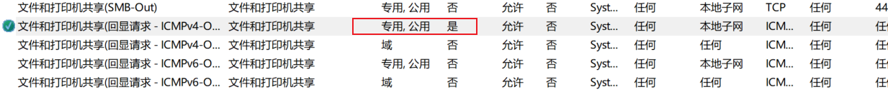

# 杂项

## 局域网下如何ping另一台电脑

[两台电脑相互之间A能ping通B ,而B 不能ping通A 2台电脑局域网的机器互联问题](https://zhuanlan.zhihu.com/p/139492390)

```txt
搜索 -> 防火墙 -> 高级设置 -> 入站规则 -> 文件和打印机共享(回显请求 - ICMPv4-In) -> 启用规则
注意选择 专有/公用 的配置文件
```


## 我在电脑A中使用wsl安装了ubuntu的子系统，我现在在电脑B中如何去ping电脑A的子系统呢

1. 获取linux子系统的虚拟网卡代理端口
   
```bash
ifconfig
# eth0:  inet addr:172.18.148.203

# 格式：netsh interface portproxy add v4tov4 listenport=Windows端口 listenaddress=WindowsIP connectport=WSL端口 connectaddress=WSL_IP
netsh interface portproxy add v4tov4 listenport=2222 listenaddress=0.0.0.0 connectport=22 connectaddress=172.18.148.203

ping 192.168.32.89:2222
```

```txt
要通过电脑B ping通电脑A上WSL（Windows Subsystem for Linux）的Ubuntu子系统，需要理解WSL的网络架构并针对性配置。以下是详细步骤和原理说明：

一、核心问题：WSL的网络隔离性

WSL（尤其是WSL 2）运行在Windows的虚拟网络命名空间中，其网络接口是Windows主机的虚拟网卡（如 vEthernet (WSL)），因此：
• WSL 2：拥有独立的虚拟IP（如 172.28.x.x），与Windows主机共享物理网卡，但外部设备（如电脑B）无法直接访问该IP（因属于局域网内的私有虚拟网络）。

• WSL 1：与Windows主机共享网络命名空间，IP与Windows主机的局域网IP一致（如 192.168.1.100），理论上外部设备可直接访问（但实际受防火墙限制）。

二、针对WSL 2的解决方案（推荐）

若电脑A的WSL是WSL 2版本（默认安装的最新版），需通过端口转发让外部设备访问WSL的服务。以下是具体步骤：

步骤1：确认WSL版本

在电脑A的Windows命令提示符中运行：
wsl -l -v

输出类似：

  NAME            STATE           VERSION
* Ubuntu          Running         2

若版本为 2，需执行端口转发；若为 1，可直接跳过端口转发（但仍需配置防火墙）。

步骤2：获取WSL子系统的内部IP（WSL 2）

在WSL的Ubuntu终端中运行：
ip addr show eth0

找到 inet 字段的IP（如 172.28.208.1），这是WSL 2的虚拟IP（仅在Windows主机和WSL之间互通）。

步骤3：在Windows主机上设置端口转发

需要将Windows主机的某个端口（如 2222）映射到WSL子系统的目标端口（如SSH的 22 端口），使外部设备通过Windows主机的IP和转发端口访问WSL。

方法1：使用 netsh 命令（临时转发，重启失效）  
在Windows命令提示符（以管理员身份运行）中执行：
# 格式：netsh interface portproxy add v4tov4 listenport=Windows端口 listenaddress=WindowsIP connectport=WSL端口 connectaddress=WSL_IP
netsh interface portproxy add v4tov4 listenport=2222 listenaddress=0.0.0.0 connectport=22 connectaddress=172.28.208.1

• listenport=2222：Windows主机开放的端口（外部设备通过此端口访问）。

• connectport=22：WSL子系统的SSH端口（默认22）。

• connectaddress=172.28.208.1：WSL的虚拟IP（步骤2中获取）。

方法2：使用PowerShell（永久转发，需管理员权限）  
在PowerShell（管理员模式）中执行：
# 添加端口转发规则
Add-NetNatStaticMapping -NatName "WSL2Nat" -Protocol Tcp -ExternalIPAddress 0.0.0.0 -ExternalPort 2222 -InternalIPAddress 172.28.208.1 -InternalPort 22

# 保存规则（避免重启丢失）
Get-NetNatStaticMapping | Save-NetNatStaticMapping -Path "C:\WSL2PortForwarding.json"

# 重启后加载规则（可选）
# Load-NetNatStaticMapping -Path "C:\WSL2PortForwarding.json"


步骤4：配置Windows防火墙允许端口访问

需允许外部设备通过转发的端口（如 2222）访问Windows主机：
1. 打开 Windows Defender 防火墙（控制面板 → 系统和安全 → Windows Defender 防火墙）。
2. 点击 高级设置 → 入站规则 → 新建规则。
3. 规则类型选择 端口 → 协议选择 TCP → 特定本地端口输入 2222 → 操作选择 允许连接 → 勾选所有网络类型（域、专用、公用）→ 命名规则（如 WSL2_SSH）→ 完成。

步骤5：电脑B测试连通性

在电脑B的命令提示符中，通过Windows主机的局域网IP和转发端口测试：
# 测试SSH端口（若WSL安装了OpenSSH）
telnet 电脑A的局域网IP 2222  # 如：telnet 192.168.1.100 2222

# 若连接成功，会显示SSH服务的欢迎信息（如“SSH-2.0-OpenSSH_8.2p1”）

若能连接，说明端口转发和防火墙配置成功，电脑B可通过此端口间接访问WSL子系统。

三、针对WSL 1的解决方案

WSL 1与Windows主机共享网络命名空间，其IP与Windows主机的局域网IP一致（如 192.168.1.100），但需注意：
• 防火墙限制：Windows防火墙可能阻止外部设备访问WSL的服务（如SSH）。

• 服务监听地址：WSL中的服务（如SSH）需监听 0.0.0.0（所有接口），而非仅 localhost。

操作步骤：
1. 在WSL中启动SSH服务（若未安装需先安装）：
   sudo apt update && sudo apt install openssh-server
   sudo service ssh start  # 启动SSH服务
   
2. 确保SSH服务监听所有接口：
   sudo sed -i 's/#ListenAddress 0.0.0.0/ListenAddress 0.0.0.0/' /etc/ssh/sshd_config
   sudo service ssh restart
   
3. 在Windows防火墙中允许SSH端口（默认22）的入站连接（步骤同WSL 2的步骤4）。
4. 电脑B通过Windows主机的局域网IP直接ping：
   ping 电脑A的局域网IP  # 如：ping 192.168.1.100
   

四、注意事项

1. WSL 2的虚拟IP动态变化：WSL 2的虚拟IP（如 172.28.x.x）在重启后可能变化，需重新配置端口转发（可通过脚本自动化）。
2. 多网卡场景：若Windows主机有多个虚拟网卡（如Hyper-V、VPN），需确保 netsh 命令中的 listenaddress=0.0.0.0 监听所有接口。
3. 性能影响：端口转发会引入一定网络延迟，但对大多数场景影响可忽略。
4. 直接Ping WSL内部IP不可行：电脑B与WSL 2的虚拟IP不在同一局域网，无法直接ping通（WSL 2的虚拟网络是Windows内部的私有网络）。

总结

• WSL 2：需通过端口转发将Windows主机的端口映射到WSL的虚拟IP和端口，外部设备通过Windows主机的局域网IP+转发端口访问。

• WSL 1：WSL与Windows共享IP，外部设备可直接通过Windows的局域网IP访问（需开放防火墙和服务监听地址）。
```

## telnet 安装

[Window10安装Telnet/SSH服务端服务端](https://blog.csdn.net/weixin_43886198/article/details/113040163)

```txt
搜索 -> 启动或关闭 Windows 功能 -> 勾选 Telnet 服务 
```


### 命令
```bash
# 查看端口是否被占用
# telnet ip port
telnet 192.168.32.89 22 # ssh服务端口
```